# Crypto OHLCV Exploratory Data Analysis

**Period:** 2021-03-28 to 2026-03-26  
**Assets:** BTC, ETH, SOL, BNB, XRP  
**Trading days:** 1825

## 1. Summary Statistics

| Asset   | Ann. Return   | Ann. Volatility   |   Sharpe |   Skewness |   Kurtosis | Max DD   |   Days |
|:--------|:--------------|:------------------|---------:|-----------:|-----------:|:---------|-------:|
| BTC     | 4.1%          | 56.3%             |    0.073 |     -0.257 |       3.97 | -76.6%   |   1825 |
| ETH     | 3.6%          | 76.4%             |    0.048 |     -0.262 |       5.26 | -79.4%   |   1825 |
| SOL     | 33.1%         | 107.5%            |    0.308 |     -0.608 |       9.79 | -96.3%   |   1825 |
| BNB     | 17.0%         | 70.2%             |    0.242 |     -0.855 |      13.19 | -70.8%   |   1825 |
| XRP     | 18.1%         | 93.8%             |    0.193 |      1.109 |      16.76 | -83.2%   |   1825 |

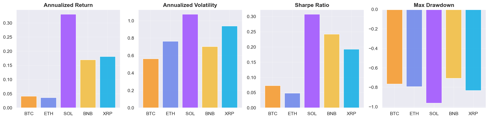

## 2. Price Evolution (Normalized)

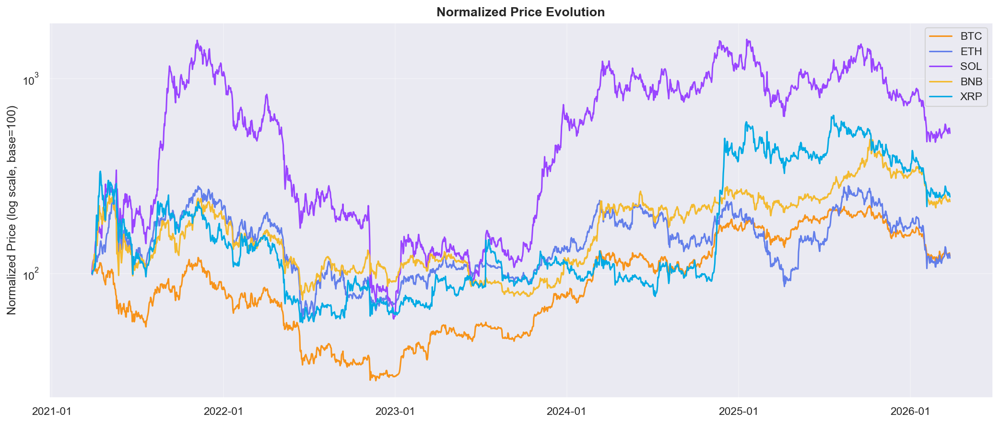

## 3. Return Distributions

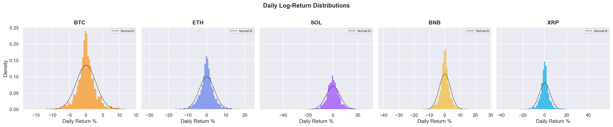

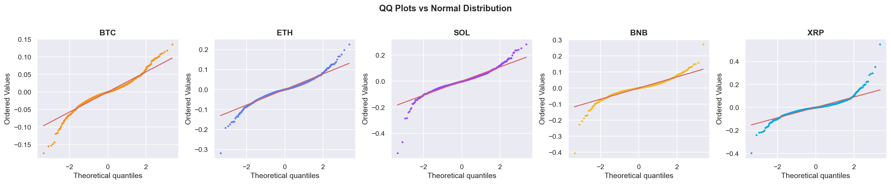

### Normality Tests

| Asset | Jarque-Bera stat | JB p-value | Shapiro-Wilk p | Skewness | Excess Kurtosis |
|-------|-----------------|------------|----------------|----------|-----------------|
| BTC | 1211.0 | 1.06e-263 | 5.94e-26 | -0.257 | 3.97 |
| ETH | 2108.0 | 0.00e+00 | 4.17e-26 | -0.262 | 5.26 |
| SOL | 7352.3 | 0.00e+00 | 3.85e-29 | -0.608 | 9.79 |
| BNB | 13363.1 | 0.00e+00 | 6.40e-34 | -0.855 | 13.19 |
| XRP | 21600.3 | 0.00e+00 | 1.38e-38 | 1.109 | 16.76 |

All assets reject normality (p < 0.001). Heavy tails and negative skew are consistent with crypto markets.

## 4. Volatility Clustering

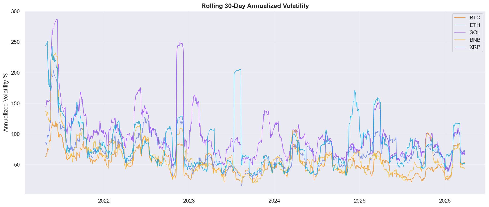

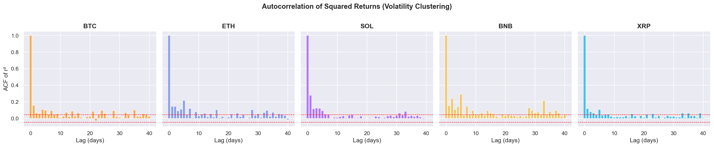

Significant autocorrelation in squared returns confirms volatility clustering across all assets — periods of high volatility tend to persist.

## 5. Correlation Structure

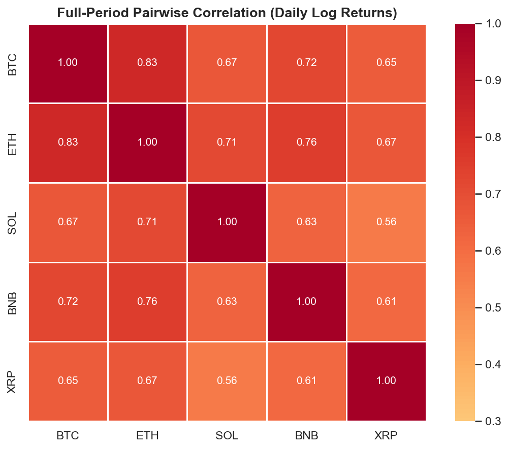

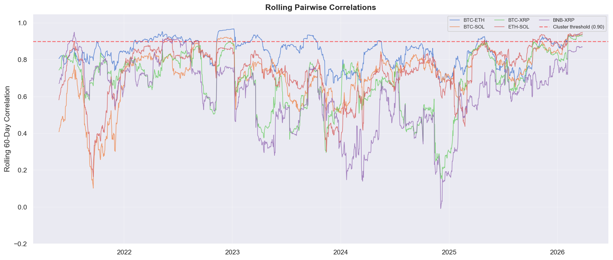

### Yearly Correlation (BTC vs others)

| Year | ETH | SOL | BNB | XRP |
|------|-----|-----|-----|-----|
| 2021 | 0.80 | 0.47 | 0.73 | 0.70 |
| 2022 | 0.90 | 0.79 | 0.83 | 0.75 |
| 2023 | 0.83 | 0.62 | 0.63 | 0.46 |
| 2024 | 0.80 | 0.75 | 0.64 | 0.46 |
| 2025 | 0.82 | 0.80 | 0.66 | 0.78 |
| 2026 | 0.93 | 0.93 | 0.92 | 0.90 |

## 6. PCA of Returns

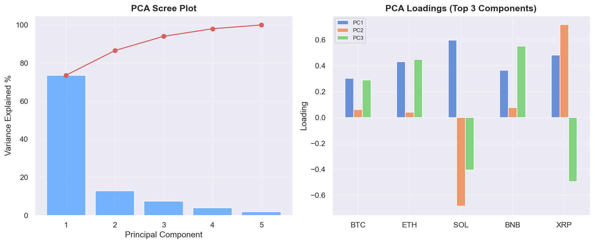

PC1 explains **73.6%** of return variance — consistent with a dominant market factor driving all crypto assets.

## 7. Market Regimes

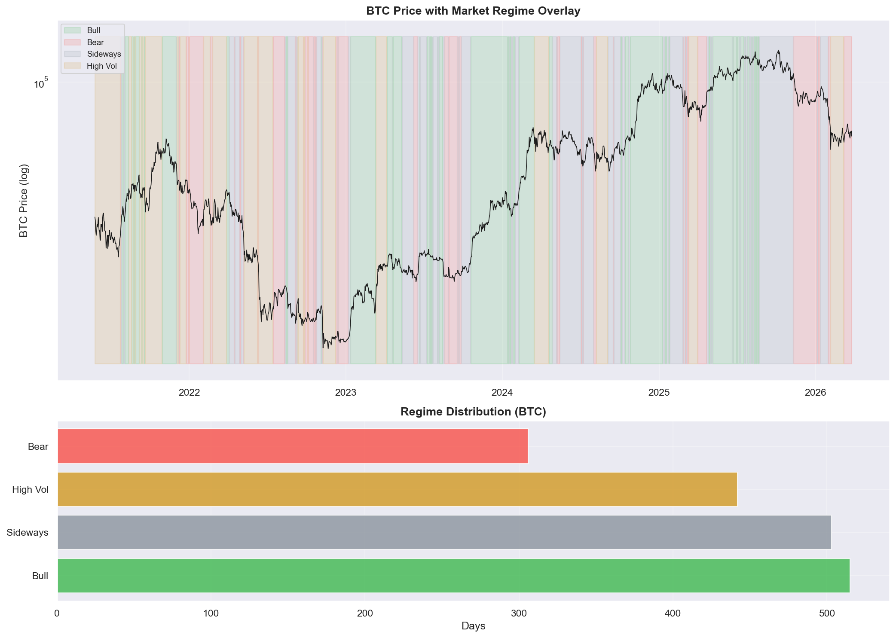

### Regime Statistics (BTC)

| Regime | Days | % of Period | Avg Daily Return | Avg Vol (ann.) |
|--------|------|-------------|-----------------|----------------|
| Bull | 515 | 29.2% | 152.0% | 45.4% |
| Bear | 306 | 17.3% | -171.2% | 47.4% |
| Sideways | 503 | 28.5% | -9.4% | 40.6% |
| High Vol | 442 | 25.0% | 0.3% | 78.2% |

## 8. Tail Risk Analysis

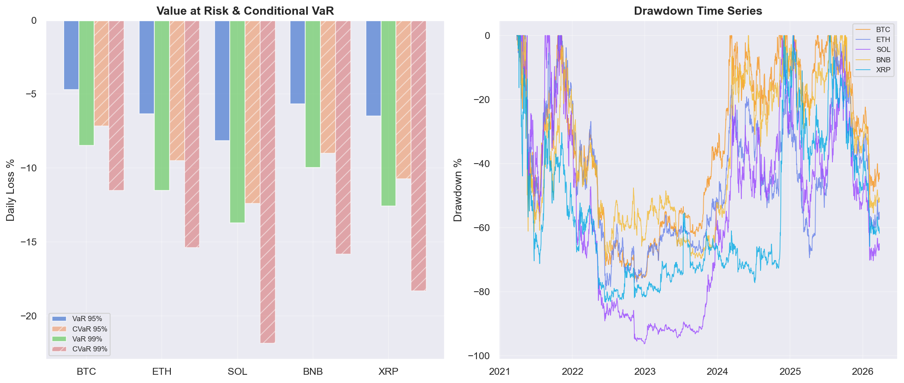

### VaR & CVaR (Daily)

| Asset | VaR 95% | CVaR 95% | VaR 99% | CVaR 99% |
|-------|---------|----------|---------|----------|
| BTC | -4.69% | -7.15% | -8.47% | -11.52% |
| ETH | -6.35% | -9.50% | -11.52% | -15.39% |
| SOL | -8.17% | -12.40% | -13.71% | -21.86% |
| BNB | -5.66% | -9.00% | -9.96% | -15.82% |
| XRP | -6.48% | -10.74% | -12.56% | -18.31% |

## 9. Volume Analysis

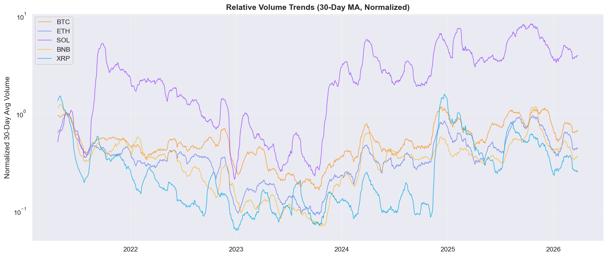
