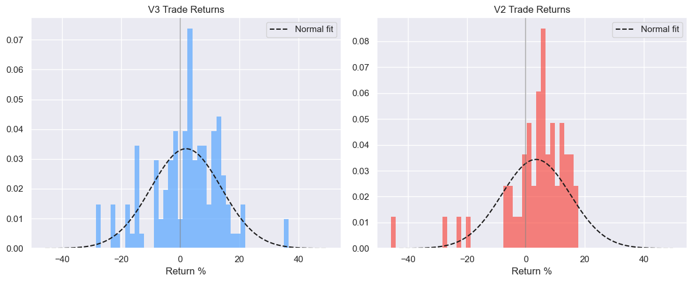
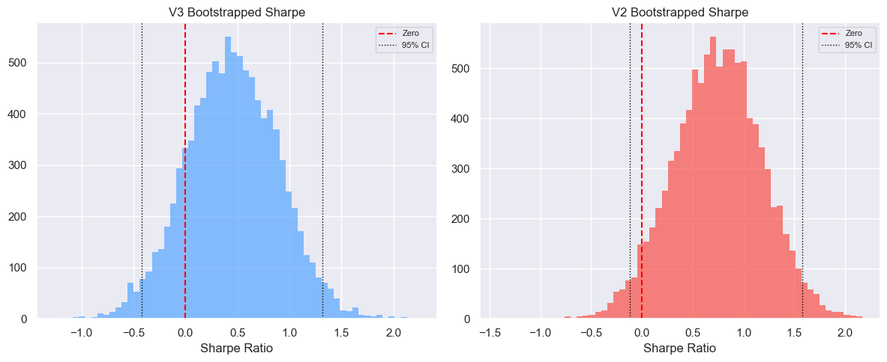
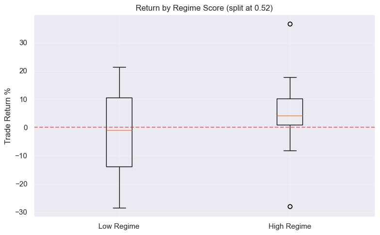
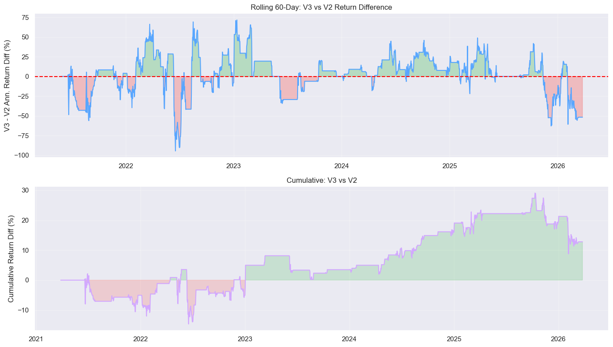

# Statistical Analysis of Trading Strategy Results

## 1. Trade Return Distribution — Normality Tests

### V3 (125 trades)

| Test | Statistic | p-value | Normal? |
|------|-----------|---------|---------|
| Jarque-Bera | 3.38 | 1.8430e-01 | Yes |
| Shapiro-Wilk | 0.9696 | 6.4439e-03 | No |
| Anderson-Darling | 1.302 | crit=0.764 | No |

Skewness: -0.282, Kurtosis: 0.66

### V2 (52 trades)

| Test | Statistic | p-value | Normal? |
|------|-----------|---------|---------|
| Jarque-Bera | 104.75 | 1.7939e-23 | No |
| Shapiro-Wilk | 0.8093 | 9.8940e-07 | No |
| Anderson-Darling | 2.490 | crit=0.737 | No |

Skewness: -2.146, Kurtosis: 6.27

## 2. Win Rate — Binomial Test

**V3:** 78/125 wins (62.4%), p=3.5237e-03 **
  95% CI: [0.547, 1.000]

**V2:** 39/52 wins (75.0%), p=2.0477e-04 ***
  95% CI: [0.632, 1.000]

## 3. Sharpe Ratio — Bootstrap 95% CI

**V3:** Sharpe = 0.446, 95% CI = [-0.418, 1.315]
  NOT statistically significant (CI includes 0)

**V2:** Sharpe = 0.741, 95% CI = [-0.121, 1.580]
  NOT statistically significant (CI includes 0)

## 4. Regime Dependence — High vs Low Regime Score Trades

Median regime score split: 0.515
High regime trades: 64, mean return: 0.0506
Low regime trades: 61, mean return: -0.0123

| Test | Statistic | p-value | Significant? |
|------|-----------|---------|-------------|
| Mann-Whitney U | 2496.00 | 0.0036 | Yes |
| Welch's t-test | 3.022 | 0.0031 | Yes |

## 5. Equity Curve Stationarity — ADF Test on Daily Returns

**V3:**
  ADF statistic: -17.1228
  p-value: 7.2376e-30
  Critical values: 1%=-3.434, 5%=-2.863
  Stationary (reject unit root)

**V2:**
  ADF statistic: -15.3061
  p-value: 4.2477e-28
  Critical values: 1%=-3.434, 5%=-2.863
  Stationary (reject unit root)

## 6. V2 vs V3 Paired Comparison

Paired comparison on 1825 overlapping days:
  V3 mean daily return: 0.000235
  V2 mean daily return: 0.000165
  Difference: 0.000070

| Test | Statistic | p-value | V3 better? |
|------|-----------|---------|-----------|
| Paired t-test | 0.385 | 0.7000 | No |
| Wilcoxon signed-rank | 85141.0 | 0.6238 | No |

## 7. Drawdown Analysis

**V3:**
  Max drawdown: -19.83%
  Number of drawdown periods: 40
  Avg drawdown duration: 42 days
  Max drawdown duration: 343 days

**V2:**
  Max drawdown: -12.02%
  Number of drawdown periods: 24
  Avg drawdown duration: 71 days
  Max drawdown duration: 912 days

## 8. Serial Correlation — Ljung-Box Test on Trade Returns

**V3:**
| Lag | LB Statistic | p-value | Serial Correlation? |
|-----|-------------|---------|---------------------|
| 5 | 39.37 | 0.0000 | Yes |
| 10 | 40.89 | 0.0000 | Yes |
| 15 | 46.34 | 0.0000 | Yes |

**V2:**
| Lag | LB Statistic | p-value | Serial Correlation? |
|-----|-------------|---------|---------------------|
| 5 | 3.53 | 0.6190 | No |
| 10 | 7.32 | 0.6952 | No |
| 15 | 10.45 | 0.7906 | No |

No significant serial correlation means consecutive trade returns are independent — good for strategy robustness.